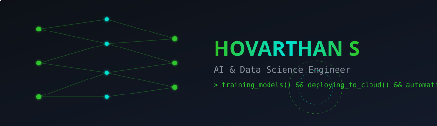

## About Me

- B.Tech in Artificial Intelligence & Data Science at Dhanalakshmi Srinivasan Engineering College **( 9.0 CGPA )**
- Core strength: **SDE, AI, Python, Machine Learning, SQL, Cloud, Automation**
- Working with **SDE, AI** in ML pipelines
- Target roles: **AI/ML Engineer**, **SDE**, **Data Science**

 

##  Tech Stack

**Languages**

**AI / Machine Learning**

**Cloud & Automation**

**Geo-AI / Geospatial**

**Databases**

**Tools**

  
  

 

##  GitHub Analytics

<!--START_SECTION:waka-->
<!-- This section can show weekly coding-time stats via WakaTime — see setup note below. -->
<!--END_SECTION:waka-->

 

##  Blogs

<!-- Send me your blog URLs (Medium / Hashnode / Dev.to / personal) and I'll replace this block with real linked cards. -->

<table>
  <tr>
    <td>
      <table width="600">
        <tr>
          <td align="center" style="padding:20px;">
            <h3> Latest from the Blog</h3>
            
<b>Hovarthan's AI & ML Blog</b>

            
Writing about AI, Machine Learning, and building intelligent systems.

            
          </td>
        </tr>
      </table>
    </td>
  </tr>
</table>

 

##  Let's Connect

         

 

